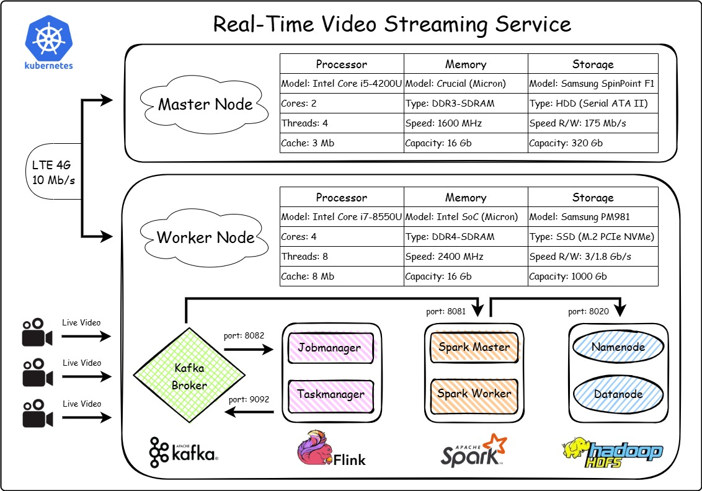

# Real-Time Video Streaming Service

## 1. Ingestion with Kafka

1. *Data Ingestion*: Kafka acts as the entry point for the video data. It ingests the video stream from the camera.

2. *Buffering*: Kafka provides a durable and scalable buffer for the video data, ensuring that even if there are temporary disruptions, the data is not lost.

3. *Message Broker*: Kafka serves as a message broker, allowing multiple consumers (like Flink and Spark) to read the video data streams in real-time.

__Process__:

•  The camera streams video data using a tool like FFmpeg, which sends the video stream to a Kafka topic.

•  Kafka brokers receive and store the video data in topics, partitioning the data for scalability and fault tolerance.

## 2. Real-Time Processing with Flink

1. *Stream Processing*: Flink consumes the video data from Kafka topics and processes it in real-time. This can include tasks like video frame analysis, filtering, and transformation.

2. *Stateful Computations*: Flink maintains state across the stream processing tasks, which is crucial for complex event processing and analytics.

3. *Low-Latency Processing*: Flink ensures low-latency processing of the video streams, making it suitable for real-time applications.

__Process__:

•  A Flink job is deployed on the Kubernetes cluster. This job consumes video data from Kafka topics.

•  The Flink job processes each video frame or chunk of data, applying the necessary transformations or analytics.

•  Processed data is then published back to Kafka for further processing.

## 3. Intermediate Storage with Kafka

1. *Buffering*: Kafka stores the processed video data from Flink, ensuring it is available for further processing by Spark.

2. *Message Broker*: Kafka continues to act as a message broker, allowing Spark to consume the processed data.

__Process__:

•  The processed video data from Flink is published to a new Kafka topic.

•  Kafka brokers store this data, making it available for Spark to consume.

## 4. Machine Learning with Spark

1. *Batch Processing*: Spark consumes the processed video data from Kafka and performs batch processing tasks.

2. *Machine Learning*: Spark uses its MLlib library to train machine learning models in real-time on the video data.

3. *Advanced Analytics*: Spark performs advanced analytics on the video data, such as anomaly detection, pattern recognition, and predictive analytics.

__Process__:

•  A Spark job is deployed on the Kubernetes cluster. This job consumes the processed video data from Kafka topics.

•  The Spark job processes the data, trains machine learning models, and performs advanced analytics.

## 5. Long-Term Storage with HDFS

After processing the data in Spark, the final processed data is written to HDFS for long-term storage.
